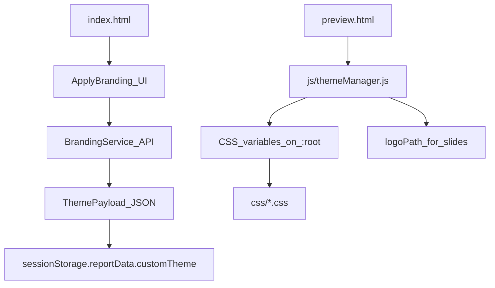

# Auto Branding (Website → Theme)

## Goal
Let a user enter a company website URL, click **Apply branding**, and automatically generate a usable report theme by extracting:
- **Logo**
- **Fonts**
- **Brand colors**
- **Industry** (optional)
- **Cover/divider imagery** (suggested from a free image provider)

The result should produce a theme payload compatible with the existing theming system:
- CSS tokens in `css/common.css`
- Runtime application via `js/themeManager.js`
- Theme definitions / registry in `js/themes/themes.js`

---

## Why a backend is required
A browser-only implementation is unreliable because:
- **CORS** blocks cross-origin fetching of most sites’ HTML/CSS/images.
- Many sites use bot protection (e.g. Cloudflare), rate limits, or dynamic rendering.
- Assets often need normalization: logo resizing, format conversion, caching, etc.

**Conclusion:** implement a small backend (or serverless function) that fetches and processes branding inputs and returns a theme payload.

---

## Proposed architecture



### Frontend
- Add an input for **Website URL** + **Apply branding** button (upload screen).
- Call backend to retrieve branding.
- Show a preview and allow manual overrides (color pickers, swap logo/image).
- Persist into `reportData` as a **custom theme**.

### Backend (“Branding Service”)
- Fetch the site and assets.
- Extract logo, colors, fonts, optional industry.
- Choose a cover/divider image from a provider.
- Return a theme payload to the frontend.

---

## Backend API contract (suggested)

### Request
`POST /api/branding`

```json
{
  "url": "https://example.com"
}
```

### Response (example)
```json
{
  "brand": {
    "name": "Example Inc",
    "industry": "Fintech",
    "site": "https://example.com"
  },
  "colors": {
    "primary": "#123456",
    "secondary": "#fa6401",
    "text": "#0f172a",
    "textMuted": "#475569",
    "textSubtle": "#94a3b8",
    "background": "#f8fafc",
    "border": "#e2e8f0",
    "surface": "#ffffff",
    "surfaceMuted": "#f1f5f9",
    "tableHeaderBg": "#0f172a",
    "tableHeaderText": "#ffffff",
    "tableAccentRowBg": "#dbeafe",
    "heatmapHighlight": "#2563eb"
  },
  "fonts": {
    "body": "system-ui, -apple-system, 'Segoe UI', Roboto, Arial, sans-serif",
    "headings": "system-ui, -apple-system, 'Segoe UI', Roboto, Arial, sans-serif",
    "googleFontsUrl": null
  },
  "assets": {
    "logoUrl": "https://.../logo.png",
    "coverImageUrl": "https://.../cover.jpg",
    "dividerImageUrl": "https://.../divider.jpg"
  },
  "charts": {
    "seriesPrimary": "#2563eb",
    "seriesSecondary": "#111827"
  },
  "confidence": {
    "logo": 0.9,
    "colors": 0.7,
    "fonts": 0.5,
    "industry": 0.6
  },
  "warnings": [
    "Font appears proprietary; using fallback stack."
  ]
}
```

**Note:** If you want a backend-less MVP, return images as `data:` URLs and store them in `reportData.customTheme.assets`, but beware browser storage limits.

---

## Extraction strategy (practical heuristics)
This is best-effort and will never be 100% accurate across the public web.

### Logo extraction
Try in order:
1. `<meta property="og:image">` (validate that it looks like a logo; this is often a hero banner)
2. `<link rel="icon">` / `<link rel="apple-touch-icon">` (fallback; often too small)
3. `` near header/nav with “logo” heuristics (`alt/src/class/id`)
4. Inline `<svg>` in header (may require server-side rasterization)

Normalize:
- download
- convert to PNG
- resize to a sensible max width (e.g. 512px)
- cache

### Font detection
- Parse HTML/CSS for `font-family` on `body` and headings.
- Detect Google Fonts via `<link href="https://fonts.googleapis.com/...">` or `@import`.

Reality check:
- Many sites use **paid/self-hosted** fonts. You can often detect the name but **cannot embed it**.\n  Recommended policy:\n  - if Google Fonts: return `googleFontsUrl` + font names\n  - else: map to a safe fallback stack and warn the user

### Color extraction
Best case:
- Site defines CSS variables like `--primary`, `--brand`, etc.

Fallback:
- Collect high-frequency colors from CSS rules
- Remove neutrals (near-white/near-black/greys)
- Cluster and pick 1–2 dominant accents
- Derive required tokens:\n  - `primary`, `secondary`\n  - `tableHeaderBg` + `tableHeaderText` (ensure contrast)\n  - `heatmapHighlight`\n  - chart colors (primary + dark neutral)

### Industry detection (optional)
- Prefer structured data (`application/ld+json`: `Organization`, `WebSite`, `sameAs`)
- Use meta tags and visible page text keywords
- Optional LLM classifier (adds cost + privacy considerations)

---

## Cover/divider images from a free image provider
Integrate one provider API (license-dependent), e.g. Unsplash / Pexels / Pixabay.

Flow:
1. Search using industry + brand keywords
2. Pick 1–3 candidates
3. Download/cache and optionally apply a color overlay/gradient to match brand
4. Return URLs (or `data:` URLs) and wire into tokens:\n   - `--slide-cover-image`\n   - `--slide-divider-image`

**Important:** handle license compliance (attribution, allowed use in commercial reports, etc.).

---

## Frontend integration (mapping to existing tokens)
The current theming system is token-based via CSS variables and `ThemeManager`.

Key tokens already used across slides/styles:
- `--primary-color`, `--secondary-color`
- `--primary-font-family`, `--headings-font-family`
- `--slide-cover-image`, `--slide-divider-image`
- `--table-header-bg`, `--table-header-text`, `--table-accent-row-bg`
- `--heatmap-highlight`
- `--chart-series-primary`, `--chart-series-secondary`

Implementation approach:
- On apply-branding success, store:\n  - `reportData.theme = 'custom'`\n  - `reportData.customTheme = <payload>`
- Extend `js/themeManager.js` to apply `customTheme` when present (instead of a registry theme).
- Ensure slide logos use `logoPath` via slide options (supported by `SlideBase.createLogo()`).

---

## MVP scope (fastest useful version)
- Backend:\n  - fetch homepage HTML + CSS\n  - extract logo (og:image fallback)\n  - extract colors (CSS variables if present; else clustering)\n  - detect Google Fonts if present\n  - select one cover image from one provider
- Frontend:\n  - Website URL input + Apply branding\n  - Preview + overrides\n  - Save to `customTheme`

---

## Risks / constraints
- **Fonts:** often proprietary; detect + fallback is the safe default.
- **Logos:** `og:image` is often not a logo; header heuristics can fail.
- **Bot blocking:** some sites will block scraping; need retries/fallbacks.
- **Licensing:** logo use + photo use may require consent/attribution.
- **Storage limits:** if you store large base64 images in browser storage, it can break.