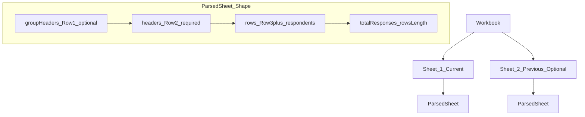

# Data mapping (Excel → Report)

This project generates a report from an uploaded Excel workbook. The mapping is **position-based** (hardcoded column indices), so the workbook must follow the expected layout.

## Row rules (Sheet 1 and Sheet 2)

The uploader expects this structure for each sheet:

- **Row 1**: Optional **grouping headers** (visual grouping only; ignored for analysis)
- **Row 2**: **Column headers / question text** (required)
- **Row 3+**: **Respondent rows** (required)

Internally we normalize each sheet to:

- `groupHeaders`: Excel Row 1 (optional)
- `headers`: Excel Row 2 (authoritative header/question row)
- `rows`: Excel Row 3+ (respondents only)
- `totalResponses`: `rows.length`

## Sheet meaning

- **Sheet 1**: current year
- **Sheet 2** (optional): previous year (used for YoY shifts where supported)

## Column mapping (0-based indices)

These are defined in `js/utils/dataCalculations.js` and are the “contract” for the workbook.

### Indices and Excel columns

- **Engagement index**: `ENGAGEMENT_INDEX_COLUMN = 12` (Excel column **M**)
- **Seacom index**: `SEACOM_INDEX_COLUMN = 25` (Excel column **Z**)
- **Core dimensions**: `CORE_DIMENSION_COLUMNS = [13..24]` (Excel columns **N–Y**)
- **Additional dimensions**: `ADDITIONAL_DIMENSION_COLUMNS = [26, 30, 35, 45, 50, 53]`
  - **AA, AE, AJ, AT, AY, BB**
- **Retention risk**:
  - `RETENTION_OVERALL_COLUMN = 8` (I)
  - `RETENTION_RISK1_COLUMN = 9` (J)
  - `RETENTION_RISK2_COLUMN = 10` (K)
- **Satisfaction**: hardcoded at column **L** (`index 11`) in `computeSatisfactionForDataset()`
- **eNPS**: `ENPS_COLUMN = 71` (BT)
- **10-point scale**: `TEN_POINT_SCALE_COLUMNS = [65, 67]` (BN, BP)
- **Comments**: `COMMENT_COLUMNS = [78..84]` (CA–CG)

### Demographic / breakdown columns (0-based)

Used by heatmaps, satisfaction, risk, etc:

- **Department**: 1 (B)
- **Cost Centre**: 2 (C)
- **Location**: 3 (D)
- **Gender**: 4 (E)
- **Race**: 5 (F)
- **Age group**: 6 (G)
- **Tenure / LoS group**: 7 (H)

## Slide dependencies (high level)

- **Methodology** (`js/slides/MethodologySlide.js`)
  - Uses `uniqueResponses = current.totalResponses` and a **hardcoded** headcount in `js/slideGenerator.js`
- **Engagement bar chart**
  - Uses `ENGAGEMENT_INDEX_COLUMN` and `CORE_DIMENSION_COLUMNS`
- **Seacom bar chart & dimension statements**
  - Uses `SEACOM_INDEX_COLUMN` and `ADDITIONAL_DIMENSION_COLUMNS`
- **Satisfaction (Location / Cost centre / Department)**
  - Uses column L (index 11) for satisfaction and B/C/D (indices 1/2/3) for grouping
- **Heatmaps**
  - Uses engagement + core + additional + seacom index columns and the breakdown column map above
- **Retention risk**
  - Uses `RETENTION_*` columns and breakdown columns
- **eNPS**
  - Uses `ENPS_COLUMN` and breakdown columns
- **Comments**
  - Uses `COMMENT_COLUMNS` and renders per-question responses (no summary row is assumed)

## Notes / constraints

- Column mapping is currently **hardcoded**, so moving columns in the workbook will break results.
- Row 1 is treated as visual grouping only; analysis always starts from Row 3.

